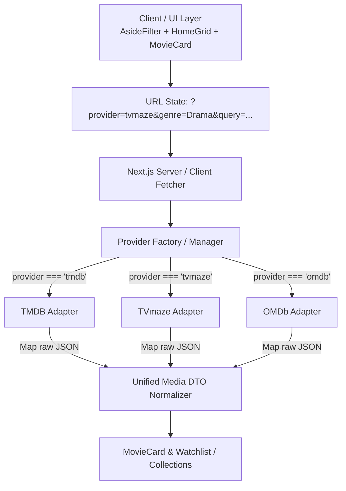

# Dynamic API Providers Architecture & Implementation Plan
**Project:** MMC - My Movies Collection  
**Feature:** Multi-Provider Dynamic Data Ingestion (TMDB, TVmaze & Beyond)

---

## 1. Executive Summary & Concept Evaluation

### Why This is a Fantastic Idea:
1. **True Content Aggregator:** MMC transitions from a TMDB-only wrapper into a versatile multi-source cinema & TV entertainment platform.
2. **Specialized Strengths:**
   - **TMDB:** Comprehensive global movies & TV database, OTT provider streaming data, posters, and multilingual discovery.
   - **TVmaze:** World-class TV/web-series scheduling, episode breakdowns, air-date tracking, completely free with no API key requirement.
   - **Future Providers (Watchmode, AniList, OMDb):** OTT streaming availability, anime catalog, and IMDb/Rotten Tomatoes ratings.
3. **Dynamic UX:** Sidebar filters automatically adjust based on what the selected provider supports, preventing broken queries and delivering a tailored filtering experience.

---

## 2. System Architecture: Adapter Pattern



### 2.1 Unified Media DTO (Data Transfer Object)
Regardless of the API source, data is normalized into a standard shape before reaching the UI:

```typescript
interface NormalizedMedia {
  id: string | number;               // Raw provider ID (e.g. 82)
  provider: "tmdb" | "tvmaze" | "omdb"; // Source API
  mediaType: "movie" | "tv";         // Media kind
  compositeId: string;               // e.g. "tmdb:movie:550" or "tvmaze:tv:82"
  title: string;                     // Title or Show Name
  overview: string;                  // Clean text summary (HTML tags stripped)
  posterSrc: string;                 // Full absolute URL to image or fallback
  backdropSrc?: string;              // Full absolute URL
  releaseDate?: string;              // Air date or release date (YYYY-MM-DD)
  rating?: number;                   // 0-10 or 0-100 scale
  genres?: string[];                 // Array of genre strings
  status?: string;                   // "Running", "Ended", "Released"
  providers?: OTTProvider[];         // Available streaming platforms (if supported)
}
```

---

## 3. Dynamic Sidebar (`AsideFilter`) Behavior

### 3.1 Provider Capabilities Matrix

| Feature / Filter | TMDB (`tmdb`) | TVmaze (`tvmaze`) | OMDb (`omdb` future) |
| :--- | :---: | :---: | :---: |
| **Media Type Toggle** | Movies & TV Series | TV / Web Series only | Movies & Series |
| **Search Input** | Real-time query | Real-time query | Title search |
| **Language Filter** | ISO language codes (50+) | English / Primary | N/A |
| **Genre Filter** | TMDB Genre IDs | TVmaze Genres | Comma-separated |
| **Top Rated / Sort** | Vote average & Popularity | Rating score | IMDb Rating |
| **Country Schedule** | N/A | Country broadcast schedules | N/A |
| **Show Status** | N/A | Running / Ended / In Development | N/A |
| **OTT Streaming Filter** | TMDB Watch Providers | External Links / Web channels | N/A |

### 3.2 Dynamic UI Rendering Rules:
1. **Top Dropdown:** Placed at the very top of `AsideFilter.jsx`:
   - `[ API Provider: TMDB ▾ ]`
   - Options: `The Movie Database (TMDB)`, `TVmaze (Web Series & TV)`
2. **Active Filter Rendering:**
   - When **TMDB** is selected: Display Media Type toggle (Movie / TV), TMDB Genres, Language Selector, OTT Region selector.
   - When **TVmaze** is selected: Hide Language Selector and Release Type filter; Display TVmaze Genres, Show Status (Running / Ended), and Country Schedule filters.

---

## 4. Implementation Steps (Step-by-Step Roadmap)

### Phase 1: API Layer & Adapters (`ui/src/lib/providers/`)
1. Create `providers/types.js` defining standard adapter interfaces.
2. Create `providers/tmdbAdapter.js`:
   - Wraps TMDB endpoints (`/discover`, `/search`, `/genre/list`).
   - Normalizes TMDB response items.
3. Create `providers/tvmazeAdapter.js`:
   - Wraps TVmaze endpoints (`https://api.tvmaze.com/shows`, `/search/shows?q=`, `/schedule?country=`).
   - Normalizes TVmaze items (cleans HTML `<p>` tags in summary, maps `image.original` or `image.medium`).
4. Create `providers/index.js` as the registry and factory.

### Phase 2: Sidebar Filter Updates (`AsideFilter.jsx`)
1. Add `provider` query parameter sync (`?provider=tmdb` or `?provider=tvmaze`).
2. Read the active provider's capability config:
   ```javascript
   const currentProviderConfig = PROVIDERS[activeProvider];
   ```
3. Conditionally render filter sections using `currentProviderConfig.supports...`.

### Phase 3: Home Page & Grid (`page.jsx` & `HomeGrid.jsx`)
1. In `page.jsx` (Server-side):
   - Parse `params.provider || "tmdb"`.
   - Dispatch query to the corresponding adapter via `getMediaByProvider(...)`.
2. In `HomeGrid.jsx` (Client fallback & live updates):
   - Use the active provider adapter when client-side refetches occur.

### Phase 4: Watchlist & Collections Interoperability
1. **Composite ID Consistency:**
   - TMDB format: `tmdb:movie:550` or legacy `movie:550`
   - TVmaze format: `tvmaze:tv:82`
   - Custom format: `custom:123`
2. **Card Detail Fetching:**
   - When rendering a collection or watchlist containing mixed items, the card inspects the prefix (`tvmaze:`, `tmdb:`, or `custom:`) and dispatches the fetch to the appropriate provider adapter.

---

## 5. TVmaze API Endpoint Quick Reference (No API Key Required)

- **Search Shows:** `https://api.tvmaze.com/search/shows?q={query}`
- **Browse / Discover Shows by Page:** `https://api.tvmaze.com/shows?page={page}`
- **Schedule / Airing Today:** `https://api.tvmaze.com/schedule?country={country_code}&date={YYYY-MM-DD}`
- **Show Details:** `https://api.tvmaze.com/shows/{id}`
- **Cast & Crew:** `https://api.tvmaze.com/shows/{id}/cast`

---

## 6. Recommendations & Best Practices

1. **Keep TMDB as the default:** TMDB offers the broadest movie catalog, while TVmaze offers rich TV/show schedules.
2. **Preserve URL Search Params:** Store `provider=tvmaze` in the URL search params so user links, bookmarks, and browser navigation preserve the exact view.
3. **HTML Sanitization for TVmaze:** TVmaze returns show summaries containing HTML tags like `<p><b>...</b></p>`. The normalizer should clean or safely parse these strings into plain text for descriptions.
4. **Graceful Fallbacks:** If a provider has no OTT streaming logos, display standard tags or external link buttons instead of breaking the card UI.
